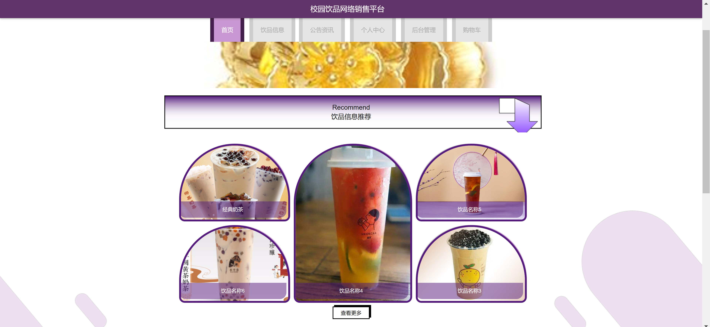
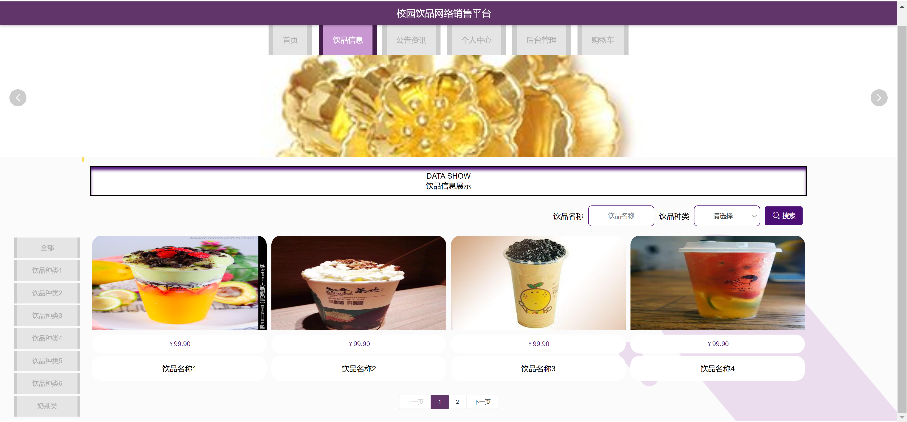
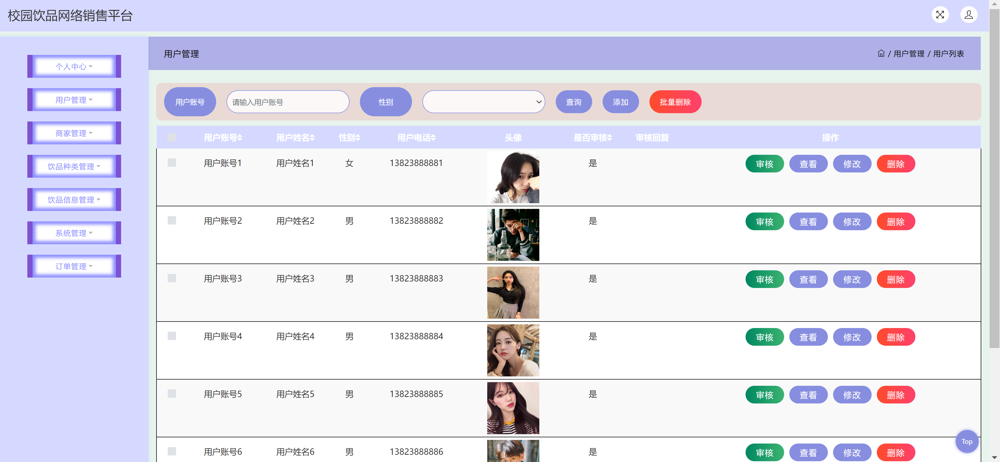
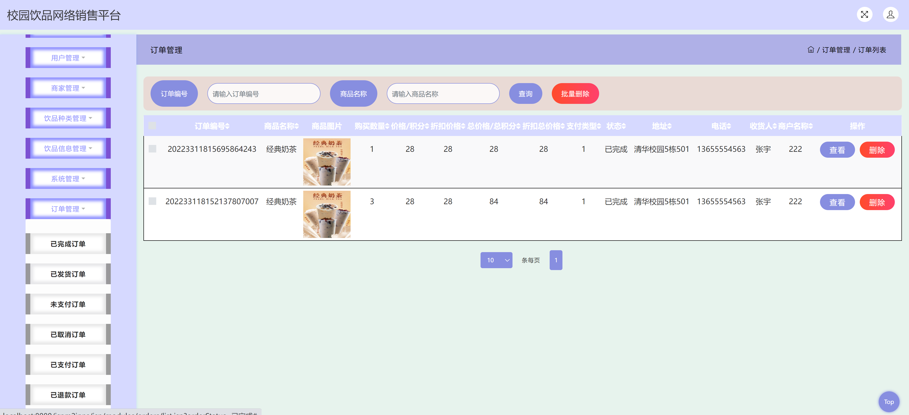

<h1 align="center">校园饮品网络销售管理系统</h1>

## 简介
校园饮品网络销售管理系统：角色分为管理员、用户、商家；功能包括用户管理、订单管理、饮品信息查看、商家和用户注册、购物车、权限登录及系统设置。    --计算机毕业设计源码；毕设源码；java毕业设计源码

## 联系方式

<h3 align="center">获取完整代码与数据库文件 + 微信：bysj5151 QQ: 86050149 QQ群: 783742310</h3>

<h3 align="center">可帮忙远程部署 包运行成功！提供远程部署、修改代码、设计文档指导、代码讲解等服务！</h3>

## 功能介绍（完整见运行截图）
管理员：管理员在校园饮品网络销售管理系统中具备用户管理、商家管理、饮品种类与信息管理、系统管理和订单管理等后台功能。可以对用户进行审核、查看、修改或删除操作，并具备批量操作能力，支持商家和饮品数据的管理和维护。系统提供查询、添加功能，在订单管理中，可以执行状态更新和导航分页操作，以便进行详细的订单数据分析和处理。

用户：用户在系统中可以注册、登录并维护个人账户信息。主要功能包括浏览和选择饮品，查看商品的详细信息和价格，通过购物车进行商品的添加或删除，并可查看和修改订单，支持多种支付方式以完成购买。用户还可以查看订单状态、追踪配送信息，并对个人信息进行管理和更改，用户体验友好且操作便捷。

商家：商家可以通过商家注册功能注册并登录系统。商家在登录后可执行账户管理、商家信息维护，并能查看和管理自身上架的饮品信息。系统支持商家后续的信息修改，并为已注册的商家提供便捷的管理平台，以便于商家进行日常的销售活动和数据分析。

系统用户：系统为所有用户提供主导航栏，展示多种饮品信息和推荐内容。无论是管理员、普通用户还是商家，都能通过不同的权限角色访问系统不同的功能模块。各角色界面设计简洁，易于上手，使得用户能够愉快地参与校园饮品的在线购买和销售活动。

## 运行截图

本代码来源于网络,仅供学习参考使用!

